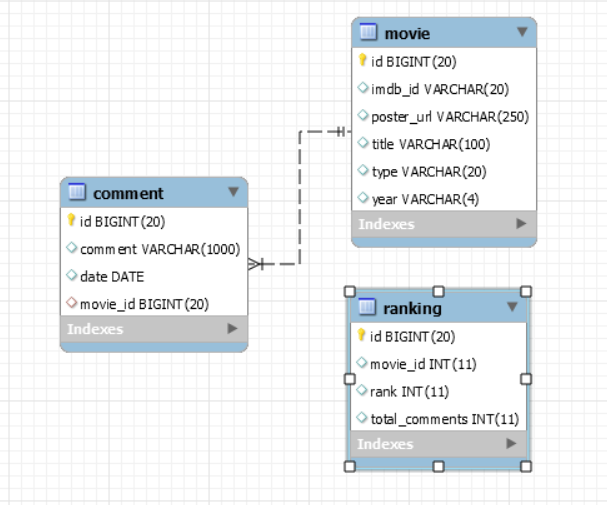

# Simple REST API - SpringBoot
Backend application which provides the communication with database and external API.

## Operating steps
To build this backend app in your computer, please follow these basic steps :

> #### 1 . Create the database
> * I chose MySql as DBMS for this exercise, so in this step you have to create a new schema in MySQL Workbench with this name "moviedb" like in the application.properties file  

> #### 2 . Configure your connection DataBase
> * Open project with an IDE like Intellij IDEA
> * Configure application.properties to connect to your database. \
For me the port is : 3306,  and the database name is : moviedb
    
       - An example for My SQL is shown below:
       
       spring.datasource.url=jdbc:mysql://localhost:3306/moviedb?useSSL=false&useUnicode=true&useJDBCCompliantTimezoneShift=true&useLegacyDatetimeCode=false&zeroDateTimeBehavior=convertToNull&serverTimezone=Europe/Paris
       spring.datasource.username=YOUR_USERNAME (root)
       spring.datasource.password=YOUR_PASSWORD
       

> #### 3 . Launch Application
> * You can run this SpringBoot application either by IDE or via command line
    ```
    > mvn spring-boot:run
    ``` 
   *  To test The APIs you can connect to http://localhost:8081/swagger-ui.html and use Swagger or via Postman
   \
   => Note that '8081' is the server port

#### Database Diagram 


